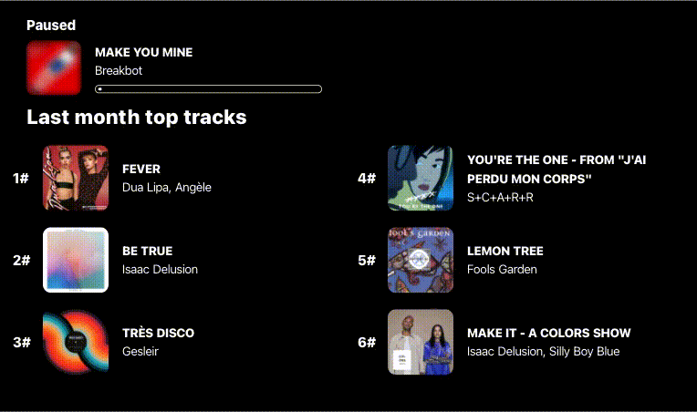

<h1 align=center>🔊 nowplayify</h1>
<div align=center></div>

## 📖 Decription
💻 Web application made using [Nuxt](https://nuxtjs.org) and the [Spotify API](https://developer.spotify.com/documentation/web-api/).

While playing on your Spotify account, it shows the currently playing track. While not playing, it shows the paused track and your last month 6 top tracks.

Mainly done to deploy it on a Raspberry Pi to use it as a decoration frame (on a 7" touch screen).

## 👨🏻‍💻 Demo
You can find a demo [here](https://nowplayify.herokuapp.com). (Allow pop-up in your browser if nothing happens)

## 🤯 Backend
Here is the repository for the backend part. It handles authentication part with the Spotify API.
## 🛠 Install
### Backend
- Run these commands
```bash
# clone backend code
$ git clone https://github.com/qeude/nowplayify-api.git
$ cd nowplayifi-api
$ touch .env
```
- In the `.env` file add these lines with your [spotify developer informations](https://developer.spotify.com/dashboard/)
```
CLIENT_ID=<YOUR_SPOTIFY_CLIENT_ID>
CLIENT_SECRET=<YOUR_SPOTIFY_CLIENT_SECRET>
NODE_ENV=development
```
- Then run
```bash
# install dependencies
$ yarn install

# start local server
$ yarn start
```
### Frontend
- Run
```bash
# clone repo
$ git clone https://github.com/qeude/nowplayify.git
$ cd nowplayify
$ touch .env
```
- In the `.env` file add this line
```
AUTH_API_URL=http://localhost:5000/
```
- Then run
```bash
# install dependencies
$ yarn install

# start local server
$ yarn dev
```

## 👨🏻‍💻 Developer
* Quentin Eude
    * [Github](https://github.com/qeude)
    * [LinkedIn](https://www.linkedin.com/in/quentineude/)